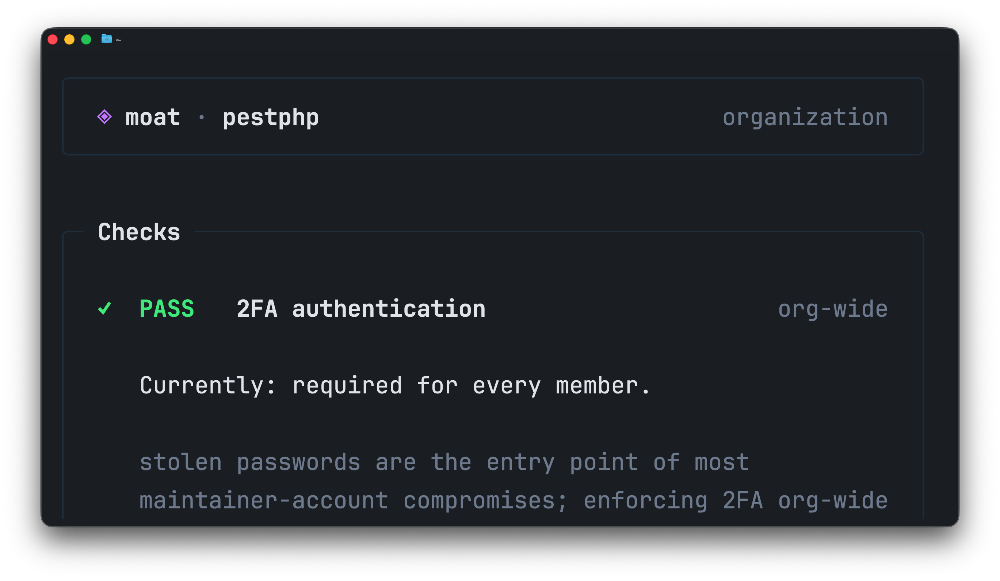

<p align="center">
    
    <p align="center">
        <a href="https://github.com/nunomaduro/moat/actions"></a>
        <a href="https://github.com/nunomaduro/moat/releases"></a>
        <a href="https://github.com/nunomaduro/moat/blob/0.x/LICENSE"></a>
    </p>
</p>

## Introduction

**moat** is a supply-chain security auditor for GitHub organizations. It works with any GitHub **user**, **organization**, or **repository** — auditing the controls you want in place before a malicious dependency, a compromised maintainer account, or a leaked token turns into an incident.

It checks **two-factor authentication**, **branch protection**, **signed commits**, **secret scanning**, **Dependabot alerts**, **workflow permissions**, **pinned actions**, **repository webhooks**, and more. Zero config — just install and run.

## Installation

> **Works with any GitHub organization, user, or repository.** A `GITHUB_TOKEN`, `GH_TOKEN`, or [GitHub CLI](https://cli.github.com) login is required.

### Homebrew (macOS / Linux)

```bash
brew install nunomaduro/tap/moat
```

### Prebuilt binaries

Download the archive for your platform from the [releases page](https://github.com/nunomaduro/moat/releases) and place `moat` on your `PATH`.

## Usage

```bash
moat audit <account>
```

`<account>` can be a GitHub organization, a user, or an `<owner>/<repo>` slug.

```bash
moat audit <your-org>
moat audit <owner>/<repo>
```

## Authentication

`moat` resolves a GitHub token in this order:

1. `GITHUB_TOKEN` environment variable
2. `GH_TOKEN` environment variable
3. `gh auth token` (if the [GitHub CLI](https://cli.github.com) is installed and logged in)

For organization audits the token needs:

- `read:org` — list members, admins, outside collaborators, 2FA enforcement
- `repo` — read branch protection, required reviews, secret scanning, Dependabot alerts, workflow files, repository contents (`SECURITY.md`), and repository webhooks

A classic PAT or a fine-grained token with the equivalent permissions both work. For user accounts (no org scope), only repo read access is required.

## Checks

### Organization

- Two-factor authentication required for all members
- Members without 2FA enabled
- Number of organization admins (owners)
- Outside collaborators with access to private repos
- Default repository permission for org members (`read`/`none` pass, `write`/`admin` fail)

### Repository

- Branch protection enabled on the default branch
- Pull request reviews required before merge
- Signed commits required
- Secret scanning enabled
- Push protection enabled
- Dependabot alerts enabled
- Default `GITHUB_TOKEN` workflow permissions (read vs. write)
- Branch protection enforced on admins (no bypass on the default branch)
- Default branch requires linear history and disallows force pushes and deletions
- Every `uses:` in `.github/workflows/*.yml` pinned to a 40-char commit SHA
- No workflow combines `pull_request_target` with a checkout of an untrusted PR head ref
- Every workflow declares a top-level `permissions:` block that is not `write-all`
- Repository webhooks use HTTPS and have a secret configured
- `SECURITY.md` is present (at the repo root, in `.github/`, or in `docs/`)

## Configuration

`moat` looks for a `moat.toml` file at the root of each audited repository. Use it to disable checks that don't apply to that repo. Disabled checks are still shown in the output (as `off`) but don't count toward the failure total.

```toml
[checks]
signed_commits = "off"
pinned_actions = "off"
```

Check IDs match the repository checks listed above (`branch_protection`, `signed_commits`, `pr_reviews`, `workflow_token`, `secret_scanning`, `push_protection`, `dependabot_alerts`, `admin_enforcement`, `branch_history`, `pinned_actions`, `pull_request_target`, `workflow_permissions`, `webhooks`, `security_md`). Values are `"on"` (default) or `"off"`.

## Exit Codes

- `0` — all checks passed
- non-zero — at least one check failed or an error occurred

## Contributing

Thank you for considering contributing to moat! The contribution guide can be found in the [Laravel documentation](https://laravel.com/docs/contributions).

## Code of Conduct

In order to ensure that the Laravel community is welcoming to all, please review and abide by the [Code of Conduct](https://laravel.com/docs/contributions#code-of-conduct).

## Security Vulnerabilities

Please review [our security policy](https://github.com/nunomaduro/moat/security/policy) on how to report security vulnerabilities.

## License

moat is open-sourced software licensed under the [MIT license](LICENSE).
